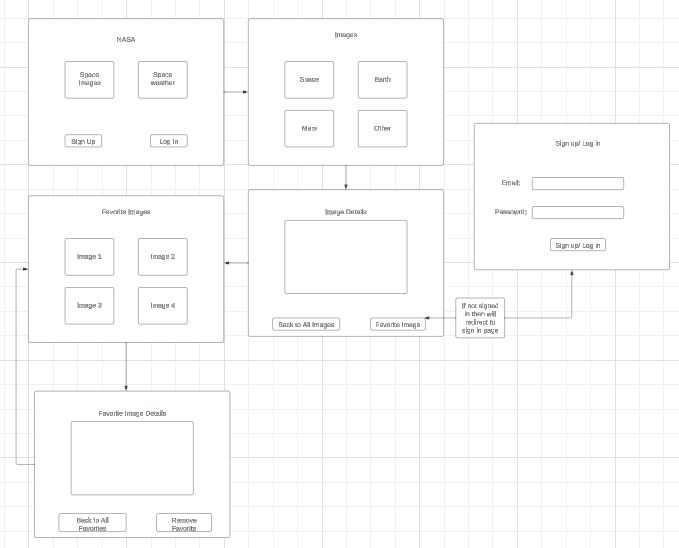
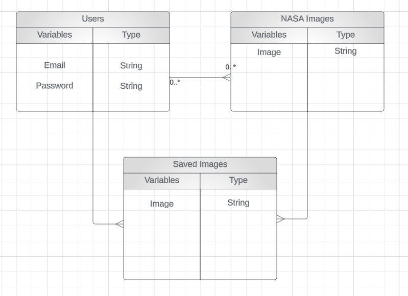

# **NASA App**

**Overview** 
This web app will allow you search through NASA information regarding earth and space. You can see images from earth satellites, mars images and space images captured from Hubble and James Web Space Telescope. Also have information regarding current and upcoming solar flares and geo magnetic storms. 

As a user, I want the ability to... 
  - sign up.
  - sign in. 
  - sign out. 
  - View images of my choosing
  - create my own favorite images list
  - update my favorites. 
  - view all of my favorites in a list. 
  - view favorites filtered by planet/region of space
  - read more details of images if available
  - delete my favorites that I wish

  **WIREFRAME** 
  

   **ERD**  
  

  **ICE BOX** 
  Future Editions will have... 
  - See other users favorite lists
  - Have public and private favorites
  - See more detailed space information
  - Email favorites to friends/family or yourself

  **API** 
  https://api.nasa.gov/  
  -Gathers data from NASA's website

